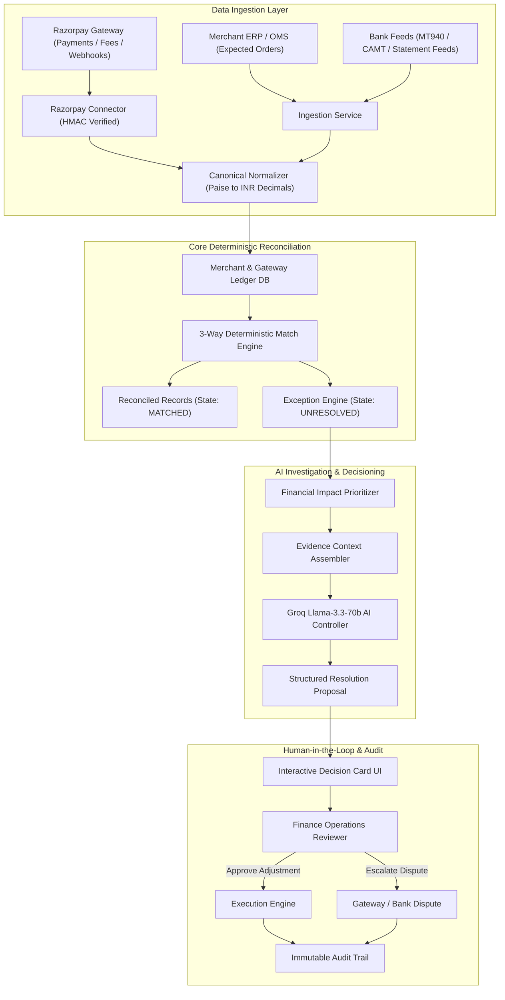

# System Architecture: AdaptiveAI Finance Controller

**Platform:** AdaptiveAI Finance Controller  
**Classification:** Core System Architecture  
**Target:** Razorpay AI Buildathon — Track 04 (AI Finance Controller)  
**Detailed Specification:** See [`RAZORPAY_FINANCE_CONTROLLER_ARCHITECTURE.md`](./RAZORPAY_FINANCE_CONTROLLER_ARCHITECTURE.md)  

---

## 1. Architectural Philosophy & Principles

AdaptiveAI Finance Controller is built around three foundational engineering principles:

1. **Deterministic Authority for Financial Mathematics:**
   Financial reconciliation, ledger arithmetic, MDR fee validation, and balance adjustments are computed **strictly by deterministic Python services** using exact decimal arithmetic (`decimal.Decimal`). Large Language Models (LLMs) are **never** permitted to calculate balances, determine match statuses, or mutate database state directly.
2. **AI as an Explanatory and Investigative Engine:**
   AI models (Groq Llama-3.3-70b-versatile) are used exclusively for root-cause synthesis, multi-source evidence explanation, natural-language exception summaries, and generating structured resolution proposals.
3. **Strict Human-in-the-Loop Financial Control:**
   No financial mutation or dispute filing occurs autonomously without operator oversight. The system surfaces structured **Decision Cards** that allow finance teams to review evidence and execute 1-click approvals with complete, tamper-evident audit logging.

---

## 2. High-Level System Architecture

---

## 3. Core Subsystems

### 3.1 Razorpay Connector & Idempotency Pipeline
- **Webhook Endpoint:** `/api/v1/razorpay/webhook` receives real-time transaction events (`payment.captured`, `settlement.processed`, `refund.created`).
- **Signature Verification:** Validates every incoming payload against the configured webhook secret using `hmac.new(..., hashlib.sha256)`.
- **Idempotent Processing:** Tracks `X-Razorpay-Event-Id` in Redis/PostgreSQL with a 7-day TTL to prevent duplicate event ingestion and replay attacks.

### 3.2 3-Way Deterministic Reconciliation Engine
- Reconciles three primary data streams:
  1. **Internal Merchant Order:** Order ID, expected net revenue, customer ID, order timestamp.
  2. **Razorpay Gateway Capture:** Payment ID, order ID, captured amount, MDR fee, GST on fee, status.
  3. **Bank Settlement Statement:** UTR reference, settlement credit, settlement timestamp, bank account.
- **Rules Evaluator:**
  - `Amount Match`: Strict equality between ERP order amount and Razorpay payment amount.
  - `Fee Validation`: Checks whether gateway fee matches agreed contract rate (e.g. 2.0% + 18% GST). Discrepancies exceeding ±₹0.01 trigger `FEE_DISCREPANCY`.
  - `Timing Window`: Matches settlements within T+1 to T+3 business days. Beyond this window, flags `TIMING_DELAY` or `MISSING_SETTLEMENT`.

### 3.3 Financial Exception Engine & Prioritization
Exceptions are automatically categorized by severity and monetary impact:
- `MISSING_SETTLEMENT`: High severity (Direct cash flow risk; payment captured but no settlement received).
- `FEE_DISCREPANCY`: Medium severity (Cumulative leakage; MDR or GST calculation mismatch).
- `STATUS_MISMATCH`: High severity (ERP marked paid, but gateway failed or pending).
- `TIMING_DELAY`: Low/Medium severity (Float delay exceeding standard SLA).

### 3.4 AI Finance Controller (Groq Llama-3.3-70b-versatile)
- Uses ultra-low-latency Groq LPUs to stream explanations in <500ms.
- **Prompt Isolation:** Financial context is injected into system prompts containing strict ground truth constraints.
- **Output Schema:** Guarantees response structures via JSON schema enforcement.

### 3.5 Human-in-the-Loop Decision Cards
- Renders an actionable dialog displaying:
  - Discrepancy title and financial impact.
  - Transaction breakdown across all 3 data sources.
  - LLM-generated root cause diagnosis and recommended action.
  - One-click buttons: **"Approve Adjustment"**, **"File Dispute with Razorpay"**, **"Dismiss"**.

### 3.6 Immutable Audit Trail
- Every resolution action records:
  - Event ID, Timestamp (UTC), Operator ID / Email, Action Type (`FEE_ADJUSTMENT`, `DISPUTE_FILED`, `MANUAL_OVERRIDE`), Target Transaction ID, and Before/After snapshots.

---

## 4. Technology Stack & Infrastructure

- **Backend:** FastAPI (Python 3.11+), Pydantic v2, SQLAlchemy 2.0, Asyncpg.
- **AI Runtime:** Groq Python SDK (`llama-3.3-70b-versatile`).
- **Database:** PostgreSQL 16 with relational indexes on `order_id`, `payment_id`, and `utr_number`.
- **Cache & Message Broker:** Redis 7 (Celery workers for batch reconciliation).
- **Frontend:** React 19, Vite, TypeScript, Tailwind CSS, Radix UI, Lucide Icons, Recharts.
- **Testing:** Pytest (Backend coverage >60%), Vitest (Frontend unit tests).

---

## 5. Architectural Boundaries: What Goes Where?

| Task | Deterministic Python Services | Groq AI Controller | Human Reviewer |
| :--- | :---: | :---: | :---: |
| Calculating totals, fees, and discrepancies | **YES** | NO | NO |
| Comparing ERP vs Gateway vs Bank amounts | **YES** | NO | NO |
| Classifying exception severity by ₹ amount | **YES** | NO | NO |
| Explaining why an exception occurred | NO | **YES** | Reviews |
| Recommending corrective action | NO | **YES** | Reviews |
| Executing ledger adjustments | NO | NO | **YES (1-Click)** |
| Escalating dispute to bank / gateway | NO | NO | **YES (1-Click)** |
