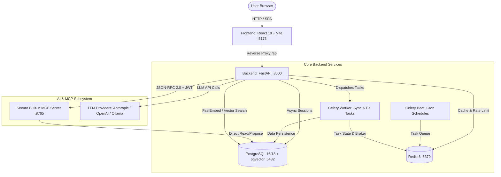
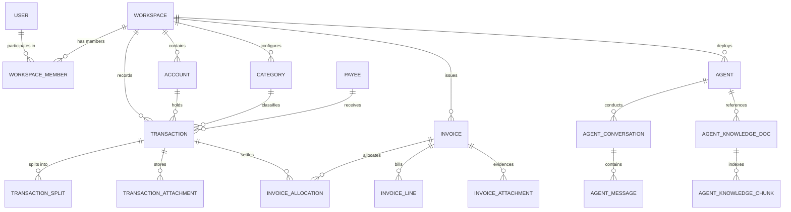
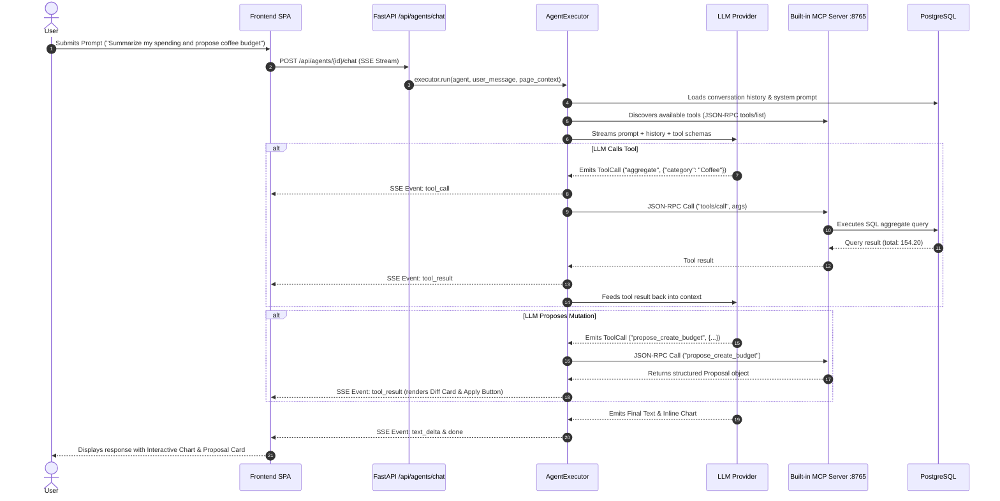

# Securo Architecture Master: Technical Reference Manual (Historical Upstream Reference)

> **HISTORICAL REFERENCE NOTICE:**  
> This document is an archived historical technical architecture reference from the upstream **Securo** project (`v0.15.0`). It is retained for open-source architectural reference and provenance tracking under the GNU AGPL-3.0.  
> **For the active AdaptiveAI Finance Controller project, please refer to the root [README.md](../../README.md) and [docs/ARCHITECTURE.md](../ARCHITECTURE.md).**

> **Document Version:** 1.0.0 (Upstream)  
> **Target System:** Securo Finance Manager (`v0.15.0`)  
> **Classification:** Upstream Open-Source Architectural Reference  

---

## 1. Executive Summary

**Securo** is a self-hosted, multi-workspace personal and business finance manager built with a privacy-first philosophy ("Finance apps want your data. This one doesn't"). It operates as an asynchronous, distributed application with a decoupled web client, API backend, persistent queue, and modular AI runtime.

### Primary Capabilities
- **Multi-Account & Multi-Workspace**: Isolated personal and business finance workspaces with running ledger balances, credit card cycle bucketing, and split-transaction management.
- **Transaction Engine & Deduplication**: Multi-format statement ingestion (OFX, QIF, CAMT.053, CSV) with deterministic SHA-256 fingerprint deduplication, transfer detection, and an expressive rule-matching engine.
- **Invoicing & Receivables Ledger**: Decoupled document tracking and settlement allocation supporting partial payments, aging buckets, tax items, and PDF generation.
- **Autonomous AI Agents & MCP**: Local-first LLM orchestration supporting Anthropic, OpenAI, Ollama, and OpenAI-compatible providers, integrated via Model Context Protocol (MCP) tool servers, Server-Sent Events (SSE) streaming, and pgvector/FastEmbed RAG.

---

## 2. Repository Structure

```
securo/
├── .env.example                        # Global environment variable documentation
├── docker-compose.yml                  # Local development compose (db, redis, backend, frontend, worker, beat, mcp)
├── docker-compose.prod.yml             # Production container orchestrations
├── install.sh                          # One-step host bootstrap script
├── start-securo.ps1                    # Native Windows/PowerShell service launcher
├── stop-securo.ps1                     # Native Windows/PowerShell service shutdown
├── backend/                            # FastAPI Application Root
│   ├── alembic/                        # Database migration scripts (85 versions)
│   ├── app/
│   │   ├── api/                        # HTTP routers (38 domain modules)
│   │   ├── core/                       # Auth, database engine, settings, rate limit, redis, workspace context
│   │   ├── models/                     # SQLAlchemy 2.0 Declarative ORM entities (30 files)
│   │   ├── schemas/                    # Pydantic v2 serialization and request validation models
│   │   ├── services/                   # Core business logic, query filters, calculations (42 files)
│   │   ├── tasks/                      # Celery asynchronous task definitions
│   │   ├── providers/                  # Bank sync (Pluggy, Enable Banking, SimpleFIN) and FX
│   │   └── agents/                     # Modular AI Agent subsystem (API, MCP client, runtime, RAG)
│   ├── mcp_server/                     # Standalone FastAPI JSON-RPC 2.0 MCP Tool Server
│   ├── tests/                          # 141 pytest modules covering API, services, and AI
│   └── pyproject.toml / uv.lock        # Python package manifests and pinned dependencies
├── frontend/                           # React 19 + Vite SPA Root
│   ├── src/
│   │   ├── pages/                      # 31 Route view components (dashboard, transactions, invoices, agents)
│   │   ├── components/                 # 78 React UI modules, Radix primitives, charts, agent panels
│   │   ├── contexts/                   # AuthContext, WorkspaceContext, CollectionFilterContext
│   │   ├── lib/                        # Axios API client (api.ts), formatting, i18n, utilities
│   │   └── types/                      # Comprehensive TypeScript definitions (index.ts)
│   ├── package.json                    # Node dependencies and build scripts
│   └── vite.config.ts                  # Vite build, proxy, and asset pipeline configuration
└── docs/                               # Architectural diagrams, specifications, and guides
```

---

## 3. System Architecture

Securo employs a service-oriented, container-ready architecture designed for complete data isolation.



---

## 4. Technology Stack

| Layer | Technologies | Version / Reference |
|---|---|---|
| **Frontend Framework** | React, TypeScript, Vite, Tailwind CSS v4 | React 19.2, Vite 8.2, Tailwind 4.3 |
| **Frontend State & UI** | TanStack React Query, Radix UI, Recharts, Lucide, i18next | Query v5.90, Recharts v3.7 |
| **Backend Framework** | Python, FastAPI, Starlette, Pydantic v2 | Python 3.11+, FastAPI 0.141, Pydantic 2.13 |
| **ORM & Database** | SQLAlchemy 2.0 (Async), Alembic, asyncpg | SQLAlchemy 2.0.52, Alembic 1.19 |
| **Primary Database** | PostgreSQL with `pgvector` extension | PG 16 (Docker) / PG 18.6 (Local) |
| **Task Queue & Cache** | Redis, Celery (with hiredis, redis-py) | Redis 8.x, Celery 5.6 |
| **Authentication** | FastAPI Users, WebAuthn (Passkeys), PyOTP (TOTP), PyJWT | WebAuthn 2.8, Cryptography 46.0 |
| **Document Processing**| ReportLab (Invoice PDF), ofxparse, pypdf, pyzipper | ReportLab 5.0, ofxparse 0.21 |
| **AI & Embeddings** | FastEmbed, ONNX Runtime, pgvector-python | FastEmbed 0.8, ONNX 1.29 |

---

## 5. Backend Architecture

The backend code is organized into clean functional layers within `backend/app`:

1. **`core/`**: Infrastructure singletons and request lifecycles.
   - [database.py](file:///m:/securo/backend/app/core/database.py): Initializes `create_async_engine` and `async_sessionmaker`.
   - [config.py](file:///m:/securo/backend/app/core/config.py): Pydantic `BaseSettings` reading environment variables with `.env` fallbacks.
   - [workspace_context.py](file:///m:/securo/backend/app/core/workspace_context.py): Extracts `X-Workspace-Id` header, verifies user membership, and enforces workspace read/write access.
   - [rate_limit.py](file:///m:/securo/backend/app/core/rate_limit.py): Redis sorted-set rolling-window rate limiter for sensitive endpoints.

2. **`models/`**: SQLAlchemy 2.0 Declarative ORM models using `Mapped[...]` and `mapped_column`.
3. **`schemas/`**: Pydantic models for incoming payload validation and outgoing serialization.
4. **`services/`**: Encapsulated business logic completely decoupled from HTTP transport.
5. **`api/`**: Thin FastAPI routers handling dependency injection, serialization, and status codes.
6. **`tasks/`**: Celery tasks triggered either via HTTP lifecycle events or scheduled beat intervals.

---

## 6. Frontend Architecture

The frontend is a single-page application built on React 19 and Vite:

1. **Routing**: [src/App.tsx](file:///m:/securo/frontend/src/App.tsx) defines declarative React Router v7 routes with code-splitting via `React.lazy()`:
   - Public: `/setup`, `/login`, `/register`, `/auth/oidc/callback`, `/i/:token` (Shared Invoice).
   - Protected: Wrapped in `<ProtectedRoute>`, `<CollectionFilterProvider>`, and `<AppLayout>`.
   - Module Gated: Wrapped in `<ModuleRoute module="...">` so workspaces only display enabled modules.

2. **State Management**:
   - Server State: Managed by **TanStack React Query** (`staleTime: 5 min`, unified cache invalidation via [invalidate-queries.ts](file:///m:/securo/frontend/src/lib/invalidate-queries.ts)).
   - Session State: Managed by React Context:
     - [AuthContext](file:///m:/securo/frontend/src/contexts/auth-context.tsx): User token, profile, passkey ceremonies.
     - [WorkspaceContext](file:///m:/securo/frontend/src/contexts/workspace-context.tsx): Active workspace, role permissions, switchers.
     - [CollectionFilterContext](file:///m:/securo/frontend/src/contexts/collection-filter-context.tsx): Global tag/collection filtering across ledger views.

3. **HTTP Client & Proxy**:
   - [api.ts](file:///m:/securo/frontend/src/lib/api.ts): Centralized Axios client with automatic request interceptors injecting `Authorization: Bearer <token>` and `X-Workspace-Id: <id>`.

---

## 7. Database Architecture

### Conceptual Entity-Relationship Diagram



### Key Database Models Reference

| Table | Entity | Key Fields | Purpose |
|---|---|---|---|
| `users` | `User` | `id`, `email`, `hashed_password`, `totp_secret`, `preferences` | Identity, authentication, and user preferences |
| `workspaces` | `Workspace` | `id`, `name`, `kind`, `tax_jurisdiction`, `default_currency` | Primary isolation container (personal or business) |
| `workspace_members`| `WorkspaceMember` | `workspace_id`, `user_id`, `role` (`owner`, `editor`, `viewer`) | RBAC membership mapping |
| `accounts` | `Account` | `id`, `workspace_id`, `type`, `balance`, `currency`, `masked_number` | Bank, card, or manual cash accounts |
| `transactions` | `Transaction` | `id`, `account_id`, `amount`, `date`, `effective_date`, `type` | Immutable financial ledger entries |
| `categories` | `Category` | `id`, `name`, `group_id`, `is_system`, `treat_as_transfer` | Classification taxonomy |
| `rules` | `Rule` | `id`, `name`, `conditions`, `actions`, `priority` | Ingestion auto-categorization engine |
| `invoices` | `Invoice` | `id`, `number`, `status`, `direction`, `total`, `due_date` | Receivable/payable invoicing records |
| `invoice_lines` | `InvoiceLine` | `invoice_id`, `description`, `quantity`, `unit_price`, `tax_rate` | Detailed line items and taxes |
| `invoice_allocations` | `InvoiceAllocation` | `invoice_id`, `transaction_id`, `amount`, `method` | Settlement mapping linking ledger cash to invoices |
| `agents` | `Agent` | `id`, `name`, `system_prompt`, `model`, `provider`, `connection_id` | AI Assistant profiles and execution policies |
| `agent_knowledge_chunks` | `KnowledgeChunk` | `doc_id`, `content`, `embedding` (`Vector(1536)` or `JSON`) | RAG vector embedding chunks |

---

## 8. Complete API Inventory

All routes are prefixed with `/api` and partitioned by domain.

### 1. Authentication & System Setup
- `GET /api/setup/status`: Checks if initial admin account exists.
- `POST /api/setup`: Provisions the initial root user and default workspace.
- `POST /api/auth/login`: Authenticates password credentials; evaluates 2FA requirements.
- `POST /api/auth/logout`: Cleans up active sessions.
- `POST /api/auth/register`: Self-registration endpoint (guarded by `REGISTRATION_ENABLED`).
- `POST /api/auth/passkeys/login/options`: Generates WebAuthn authentication challenges.
- `POST /api/auth/passkeys/login/verify`: Verifies WebAuthn assertion signatures.
- `GET /api/auth/oidc/config`: Exposes OIDC provider configurations and redirect URIs.

### 2. Workspaces & Identity
- `GET /api/workspaces`: Lists accessible workspaces for the current user.
- `POST /api/workspaces`: Creates a new personal or business workspace.
- `GET /api/workspaces/{id}`: Detailed workspace metadata and enabled modules.
- `PATCH /api/workspaces/{id}`: Updates workspace name, currency, tax jurisdiction, or fiscal details.
- `GET /api/workspaces/{id}/members`: Lists workspace members and assigned roles.
- `POST /api/workspaces/{id}/members`: Invites or assigns a user to a workspace.

### 3. Accounts & Financial Ledger
- `GET /api/accounts`: Returns accounts with running balances and primary currency equivalents.
- `POST /api/accounts`: Creates a new manual bank, cash, or credit account.
- `GET /api/accounts/{id}`: Account balance, statement closing days, and payment due days.
- `PATCH /api/accounts/{id}`: Updates account display names, limits, and parameters.
- `DELETE /api/accounts/{id}`: Soft-closes or hard-deletes an account.

### 4. Transactions & Ingestion
- `GET /api/transactions`: Paginated, filtered ledger query (by date range, account, category, payee, search).
- `POST /api/transactions`: Records a manual financial transaction.
- `PATCH /api/transactions/{id}`: Modifies classification, payee, notes, or tags.
- `DELETE /api/transactions/{id}`: Removes or voids a transaction.
- `POST /api/transactions/import`: Uploads OFX, QIF, CAMT, or CSV files for automated parsing.
- `POST /api/transactions/splits`: Splits a parent transaction into multiple sub-allocations.
- `POST /api/rules`: Registers an automated categorization rule.
- `POST /api/rules/preview`: Dry-runs rule evaluation against existing ledger transactions.

### 5. Invoices & Billing
- `GET /api/invoices`: Lists invoices filtered by direction (`receivable`/`payable`), status, and year.
- `POST /api/invoices`: Drafts a new invoice with structured line items and taxes.
- `POST /api/invoices/{id}/open`: Issues an invoice and assigns an immutable sequence number.
- `POST /api/invoices/{id}/allocations`: Links a transaction payment to settle an open invoice balance.
- `GET /api/invoices/{id}/pdf`: Downloads a generated ReportLab PDF document.
- `GET /api/public/invoices/{token}`: Public unauthenticated invoice preview using shareable tokens.

### 6. AI Agents & MCP Subsystem
- `GET /api/agents`: Lists AI assistants available in the active workspace.
- `POST /api/agents`: Creates or configures an agent profile.
- `POST /api/agents/{id}/chat`: SSE endpoint streaming assistant responses, tool calls, and charts.
- `GET /api/agents/connections`: Lists configured LLM provider connections (Ollama, OpenAI, Anthropic).
- `POST /api/agents/{id}/knowledge`: Uploads PDF/TXT documents for embedding into RAG knowledge bases.
- `POST /api/agents/mcp-tokens`: Mints long-lived JWTs for external MCP clients (Claude Desktop, n8n).

---

## 9. Authentication & Authorization

Securo supports multi-layered authentication governed by `app/core/auth.py` and `app/core/workspace_context.py`:

```mermaid
flowchart TD
    Req[Incoming HTTP Request] --> CheckToken{Bearer JWT present?}
    CheckToken -- No --> AllowPublic{Is Public Route?}
    AllowPublic -- Yes --> ExecRoute[Execute Route]
    AllowPublic -- No --> Ret401[Return 401 Unauthorized]
    
    CheckToken -- Yes --> ValJWT[Validate JWT via SECRET_KEY]
    ValJWT --> LoadUser[Load User from DB]
    LoadUser --> CheckWorkspace{X-Workspace-Id present?}
    
    CheckWorkspace -- No --> DefaultWS[Resolve Personal Workspace]
    CheckWorkspace -- Yes --> VerifyMember{Is Member or Manager?}
    
    VerifyMember -- No --> Ret403[Return 403 Forbidden]
    VerifyMember -- Yes --> CheckRole{Route requires Editor/Owner?}
    
    CheckRole -- ReadOnly Route --> Success[Grant WorkspaceContext]
    CheckRole -- Write Route --> RoleCheck{Role == Owner | Editor | Manager?}
    RoleCheck -- No --> Ret403
    RoleCheck -- Yes --> Success
```

1. **Authentication Schemes**:
   - **Local Password Auth**: Secure bcrypt hashing via `passlib`.
   - **Passkeys (FIDO2 / WebAuthn)**: Supported natively via the `webauthn` library.
   - **Two-Factor Authentication (TOTP)**: RFC 6238 compliant via `pyotp`.
   - **OpenID Connect (OIDC)**: Single Sign-On integration supporting Authentik, Pocket ID, and standard IdPs.

2. **Authorization (RBAC)**:
   - `owner`: Full workspace management, member invitation, deletion, and financial writes.
   - `editor`: Read and write permissions for financial accounts, transactions, invoices, and rules.
   - `viewer`: Read-only access to ledger records, dashboards, and reports.
   - `manager`: External administrative override assigned via `managed_by_user_id`.

---

## 10. Financial Domain Model & Calculations

Securo strictly models financial reality through verified accounting conventions:

1. **Running Balances**:
   - Account balances reflect posted ledger entries plus opening balances.
   - Cross-currency accounts maintain native balances alongside `balance_primary` calculated using spot exchange rates.

2. **Accrual vs. Cash Accounting**:
   - Every transaction carries both a purchase `date` and an `effective_date`.
   - On credit card transactions, `effective_date` maps to the credit card bill closing/due date. Cash-flow reports utilize `effective_date` so expenses register when cash leaves the user's account.

3. **Invoicing State Machine**:
   - Stored states reflect deliberate human actions: `draft`, `open`, `void`, `uncollectible`.
   - Derived states represent financial facts calculated on query:
     - `paid`: `balance <= 0`
     - `partial`: `amount_paid > 0` and `balance > 0`
     - `overdue`: `balance > 0` and `due_date < current_date`

---

## 11. File Ingestion & Parsing Engine

Statement ingestion in [app/services/import_service.py](file:///m:/securo/backend/app/services/import_service.py) handles messy real-world bank exports:

1. **Encoding Normalization**: Tries UTF-8 decoding, falling back gracefully to Latin-1.
2. **SGML/XML Header Repair**: Injects missing legacy SGML headers into modern OFX files to resolve parser ambiguity.
3. **Synthetic FITID Generation**: Banks omitting transaction IDs receive deterministic SHA-1 hashes generated from the raw statement record blocks.
4. **Deduplication Matrix**: Transactions are deduplicated against existing records using provider external IDs or computed hash signatures:
   $$\text{Hash} = \text{SHA256}(\text{account\_id} + \text{date} + \text{amount} + \text{description})$$
5. **In-Flight Rule Execution**: Newly parsed transactions pass through the in-memory rule engine prior to database persistence.

---

## 12. Reporting & Analytics Architecture

Reporting logic in [app/services/report_service.py](file:///m:/securo/backend/app/services/report_service.py) computes high-performance aggregate metrics:

- **Net Worth Trend**: Combines historic account balances and daily asset appraisals, converting foreign currencies on the fly.
- **Income vs. Expenses**: Evaluates cash inflows and outflows while strictly excluding transfer pairs, split offsets, and entries flagged as `exclude_from_pnl`.
- **Cash Flow Forecaster**: Projects future recurring expenses and predictable income over 30/60/90-day windows.
- **Category Sparklines**: Aggregates top spending categories into monthly trend series for dynamic client rendering.

---

## 13. Background Jobs & Worker Architecture

Background asynchronous operations rely on **Celery** backed by **Redis**:

- [sync_tasks.py](file:///m:/securo/backend/app/tasks/sync_tasks.py): Connects to external banking APIs (Pluggy, Enable Banking, SimpleFIN), pulling new transactions and account balances.
- [fx_rate_tasks.py](file:///m:/securo/backend/app/tasks/fx_rate_tasks.py): Synchronizes daily foreign exchange rates via Open Exchange Rates.
- [recurring_tasks.py](file:///m:/securo/backend/app/tasks/recurring_tasks.py): Detects and materializes recurring bills and subscription projections.
- [asset_tasks.py](file:///m:/securo/backend/app/tasks/asset_tasks.py): Fetches daily stock/fund tickers and updates asset market values.

---

## 14. AI Agent & MCP Architecture

The AI subsystem in `app/agents/` represents a production-grade autonomous agent architecture:



### Deterministic Safety & Tool Policies
1. **The Propose-First Safety Pattern**: Mutation tools in `proposals.py` never write directly to the database. They construct structured previews with diffs. The user must click **Apply** in the web UI, which calls the authoritative backend write API.
2. **Server-Side Arithmetic Rule**: The agent system prompt strictly instructs models never to perform mental math over transaction lists; they must query the SQL-backed `aggregate` tool directly.
3. **Structured Inline Visualizations**: Models emit fenced code blocks tagged ````securo-chart````, parsed on the client to render native Recharts components.

---

## 15. RAG & Knowledge Base Subsystem

Securo incorporates an in-process, zero-external-dependency Retrieval-Augmented Generation (RAG) engine:

- **Document Processing**: `knowledge_service.py` receives PDFs, text files, and markdown notes.
- **Chunking**: `chunking.py` segments documents using character and token boundaries with overlapping windows.
- **Embeddings**: Utilizes FastEmbed running `sentence-transformers/paraphrase-multilingual-MiniLM-L12-v2` locally via ONNX Runtime (or delegates to OpenAI/Ollama).
- **Vector Search**: Chunks are stored in the PostgreSQL database using the `Vector(1536)` column type (with a JSON fallback when uncompiled). Vector similarity queries execute via IVFFlat cosine distance indexing.

---

## 16. Security & Reliability Audit Matrix

| Security Area | Status | Technical Implementation Details |
|---|---|---|
| **Password Storage** | **IMPLEMENTED** | Bcrypt hashing with salted passwords via `passlib[bcrypt]`. |
| **Passkeys / WebAuthn** | **IMPLEMENTED** | FIDO2 challenge-response verification via python `webauthn`. |
| **Two-Factor (TOTP)** | **IMPLEMENTED** | RFC 6238 time-based OTP via `pyotp` with encrypted secret storage. |
| **OIDC / SSO** | **IMPLEMENTED** | Standard discovery, token verification, and role mapping claims. |
| **Rate Limiting** | **IMPLEMENTED** | Sliding-window Redis rate limiter on login, register, and password reset. |
| **Session Isolation** | **IMPLEMENTED** | Context-driven workspace validation on every route via `X-Workspace-Id`. |
| **CORS Policy** | **IMPLEMENTED** | Explicit origin validation bound to configured `FRONTEND_URL`. |
| **Database Encryption** | **PARTIALLY IMPLEMENTED** | Secrets/tokens stored in plaintext within Postgres columns unless configured with disk-level volume encryption. |
| **CSRF Defense** | **NOT IMPLEMENTED** | Uses Bearer Authorization tokens stored in browser localStorage; CSRF tokens are not used. |
| **Data Purge / GDPR** | **PARTIALLY IMPLEMENTED** | Soft-deletes workspaces and accounts; automated hard purge routines are unautomated. |

---

## 17. Testing & Quality Infrastructure

Securo maintains an extensive automated testing suite:
- **Backend Tests**: 141 test files in `backend/tests/` utilizing `pytest`, `pytest-asyncio`, and `aiosqlite`. Tests execute against an in-memory SQLite database using `Base.metadata.create_all` and mocked pgvector types.
- **Frontend Tests**: Vitest suite with `@testing-library/react` and `@testing-library/user-event`.
- **Linting & Formatting**: Enforced via Ruff (`ruff>=0.16.4`) and type checker `ty==0.0.75` for Python; ESLint 9 and TypeScript compiler (`tsc -b`) for React.

---

## 18. Extension Map: Blueprint for AI Finance Controller

Securo's existing architecture provides an ideal foundation for evolving into an autonomous **AI Finance Controller** (aligned with Razorpay Buildathon Track 04):

```
                                  EXISTING SECURO CORE
┌────────────────────────────────────────────────────────────────────────────────────────┐
│  Multi-Account Ledger  │  Statement Ingestion  │  Rules Engine  │  Invoicing Ledger   │
│  FastAPI Backend       │  React 19 Frontend    │  Redis/Celery  │  MCP Tool Server    │
└────────────────────────────────────┬───────────────────────────────────────────────────┘
                                     │ EXTENSION SEAMS
                                     ▼
┌────────────────────────────────────────────────────────────────────────────────────────┐
│                    RAZORPAY AI FINANCE CONTROLLER EXTENSIONS                           │
├────────────────────────────────────────────────────────────────────────────────────────┤
│ 1. Multi-Source Reconciliation Engine (Gateway Logs ⟷ Bank Settlements ⟷ Orders)      │
│ 2. Automated Settlement Q&A Agent (Natural Language Financial Queries via MCP)         │
│ 3. Forward Cash Flow Forecaster (30/60/90 Day Predictive Balance Projections)          │
│ 4. Tax & Invoice Verification (GSTIN/HSN Validation & Withholding Tax Reconciliation)  │
└────────────────────────────────────────────────────────────────────────────────────────┘
```

### Specific Extension Integration Points

1. **Multi-Source Reconciliation Engine**:
   - **Target Directory**: `backend/app/services/reconciliation_service.py`
   - **Why Here**: Builds directly on top of `import_service.py` (which already computes transaction hashes and duplicate detection) and `invoice_service.py` (which already implements allocation logic between payments and documents).
   - **Extension Mechanism**: Define a multi-way matcher that takes three data sources (Merchant Order, Gateway Transaction, Bank Payout) and creates settlement links with provable match confidence.

2. **Automated Settlement Q&A Agent**:
   - **Target Directory**: `backend/mcp_server/tools/settlements.py`
   - **Why Here**: The MCP server already exposes `aggregate.py`, `transactions.py`, and `reports.py`. Adding dedicated settlement inspection tools enables the LLM runtime to answer questions like *"Why is payout #8920 short by ₹450?"* using live SQL queries.

3. **Forward Cash Flow Forecaster**:
   - **Target Directory**: `backend/app/services/forecasting_service.py`
   - **Why Here**: Directly extends `report_service.py` and `transaction_calendar_service.py`, combining current balances with recurring subscription schedules and pending receivables.

4. **Tax & Invoice Verification**:
   - **Target Directory**: `backend/app/fiscal/packs/in.py` (Indian Fiscal Pack)
   - **Why Here**: Securo already has a modular jurisdiction system (`app/fiscal/`). Implementing the Indian tax pack activates native GSTIN validation, HSN/SAC code tracking, and automated TDS withholding deductions.

---

## 19. Critical Invariants & Rules for AI Agents

When working on or modifying this repository, autonomous agents must adhere to the following rules:

> [!IMPORTANT]
> 1. **Preserve Decimal Precision**: Never use IEEE 754 floating-point numbers (`float`) for monetary amounts or balances. Always use `Decimal` with explicit string serialization.
> 2. **Respect the Workspace Boundary**: Every database query touching financial entities MUST filter by `workspace_id`. Never write global queries that bleed across tenant workspaces.
> 3. **Never Bypass the Propose-First Safety Pattern**: AI agents must never mutate database records directly through conversational LLM actions. They must create structured proposals via `proposals.py` and require explicit human confirmation.
> 4. **Do Not Trust LLM Arithmetic**: LLMs hallucinate calculations over large numbers. Financial totals must be computed by PostgreSQL aggregate queries, not assembled in LLM context.
> 5. **Maintain Invoicing Separation**: Stored status (`draft`, `open`, `void`, `uncollectible`) must never be confused with derived status (`paid`, `partial`, `overdue`). Derived status must always be calculated dynamically.
